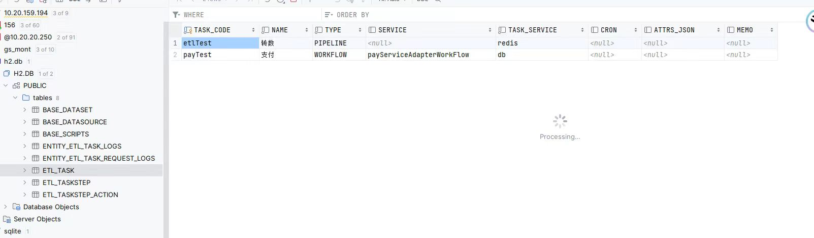
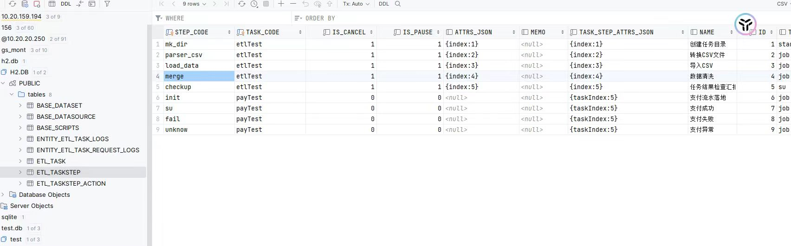
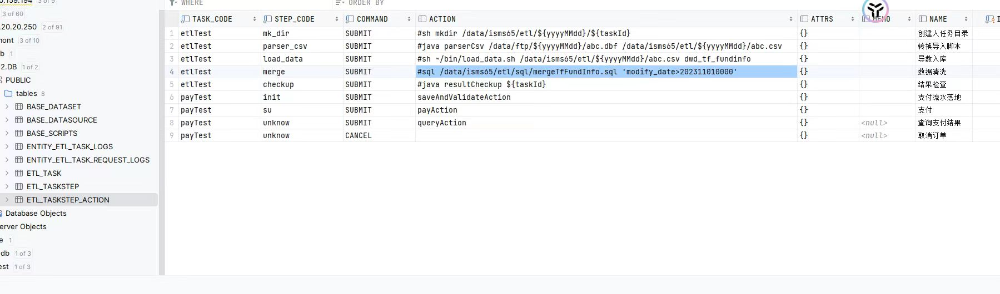
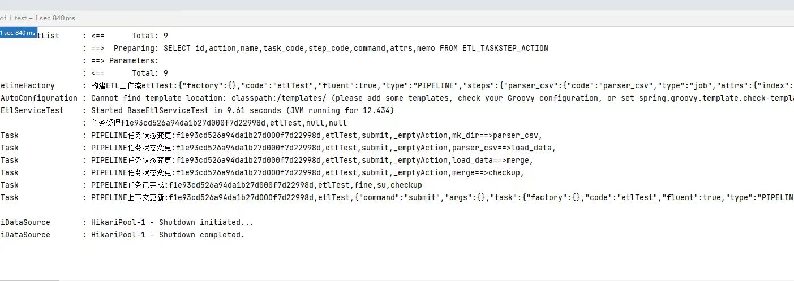

# 简要介绍

    轻量级的etl框架，只有一个jar包。比spark，hadoop，kettle等PAAS型的ETL框架轻量。可轻易集成使用
    信创友好：一套SQL，兼容mysql/oracle/dm/postresql等数据库
    高性能：SQL执行比数据库快50倍，比clickhourse快10倍
    高度配置化：大多数ETL操作配置化即可完成，无需开发代码

# quicker start

1，引入jar

        <dependency> 
            <groupId>cn.hz.ddbm.setl</groupId>
            <artifactId>setl</artifactId>
            <version>0.0.1</version>
        </dependency>

2，在etl_task表中增加任务定义

3，在etl_taskstep表中增加任务步骤

4，在etl_taskstep_action中增加步骤的业务逻辑

在其中sql组件中定义 sql:select 1 + 1 as count

5,任务运行

# 架构设计

流程编排[流程编排](https://github.com/mmbbdddd/process-control)
嵌入式计算[步骤定义](https://gitee.com/ddddbb/GuanYa)

备注：代码还么有整理完毕。